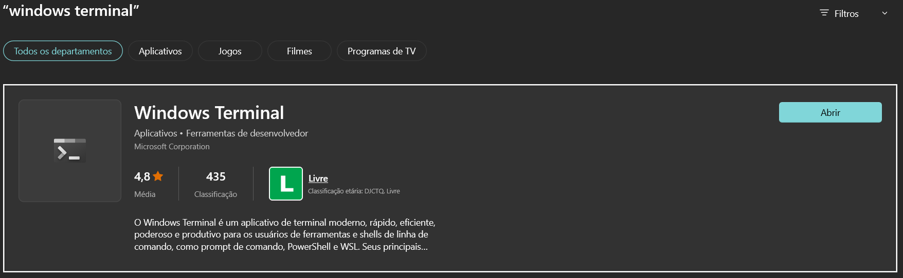
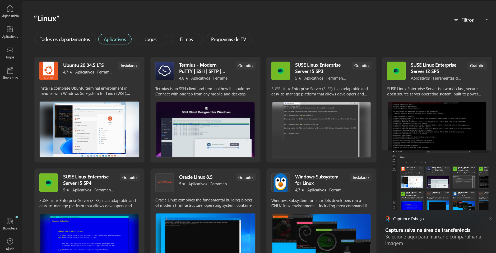
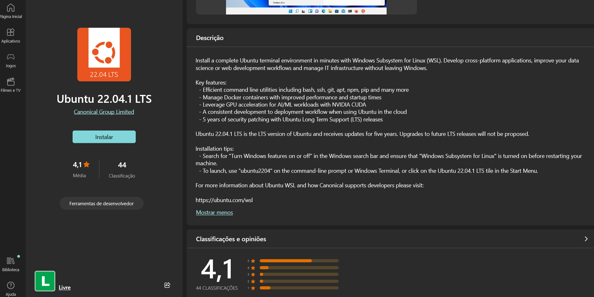
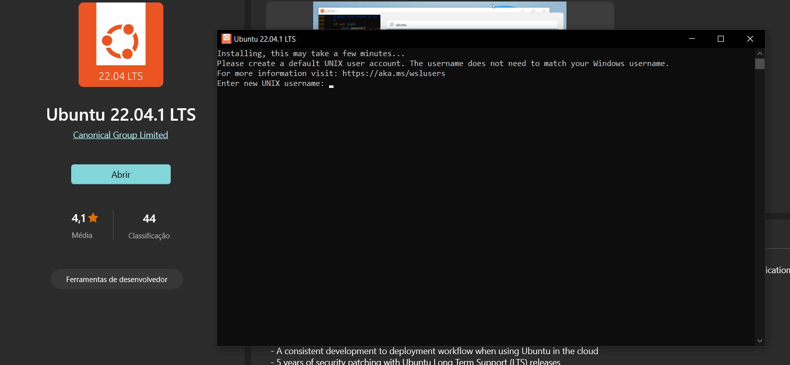
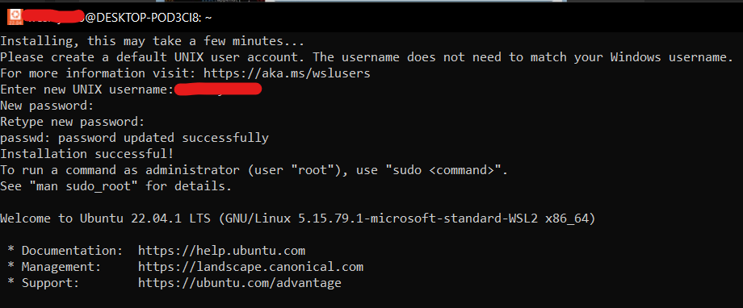
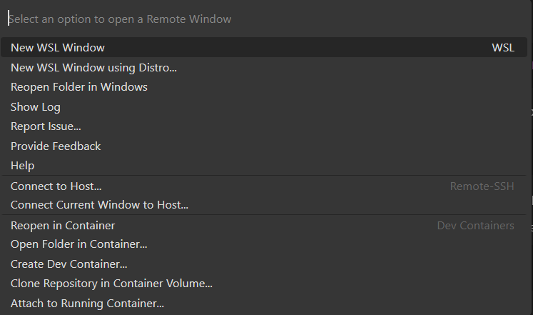

# Configurando o WSL com o Ubuntu 22.04 + ZSH

O WSL é uma excelente alternativa para desenvolvedores que querem possuir todas as vantagens do Windows e ainda manter toda a produtividade que o ambiente Linux pode oferecer.

Esta postagem é uma versão customizada do artigo da [Fullcycle](https://fullcycle.com.br) que está nesse link: [Guia rápido do WSL2 + Docker](https://github.com/codeedu/wsl2-docker-quickstart).

Também vou deixar o aqui os videos do youtube  e postagens que me ajudaram a fazer esta configuração.
 - [A forma mais produtiva para utilizar Docker no Windows e WSL2](https://www.youtube.com/watch?v=g4HKttouVxA&list=LL&index=113&t=4402s)     
 - [Ambiente perfeito de Docker com VSCode e WSL2](https://www.youtube.com/watch?v=a49gYcBwITc&list=LL&index=112&t=7661s)
 - [O Melhor Setup Dev com Arch e WSL2](https://www.youtube.com/watch?v=sjrW74Hx5Po)
 - [Instalando e Configurando o ZSH no Ubuntu 20.04](https://medium.com/@gutoinfo.ribeiro/instalando-e-configurando-o-zsh-no-ubuntu-20-04-4ef8a2499ed5)

# Índice

- [Configurando o WSL com o Ubuntu 22.04 + ZSH](#configurando-o-wsl-com-o-ubuntu-2204--zsh)
- [Índice](#índice)
- [Instalando o WSL2](#instalando-o-wsl2)
  - [Para Windows 11](#para-windows-11)
  - [Para Windows 10](#para-windows-10)
  - [Configuração de recursos de maquina no WSL](#configuração-de-recursos-de-maquina-no-wsl)
- [Escolhendo uma distro Linux](#escolhendo-uma-distro-linux)
- [Usando docker nativo](#usando-docker-nativo)
- [Habilitando o VScode](#habilitando-o-vscode)
- [ZSH e OhMyZsh](#zsh-e-ohmyzsh)
- [Nerds Fonts](#nerds-fonts)

# Instalando o WSL2
Antes de iniciar a instalação do WSL2 propriamente dita acredito que valha muito a pena instalar antes o [windows terminal](https://apps.microsoft.com/store/detail/windows-terminal/9N0DX20HK701?hl=pt-br&gl=br) por ser um emulador de terminal melhorar muito nossa produtividade alem de ser altamente customizável. Pode ser encontrado diretamente na Microsoft Store procurando por **windows terminal**, também será mostrado o windows terminal preview que é a versão beta que recebe as atualizações mais recentes.



Agora que temos o windows terminal instalado podemos executa-lo em modo **administrador**, de acordo com a documentação mais atualizada, você deve rodar o  comando.
## Para Windows 11
```sh
wsl --install
```
O processo pode ser um pouco demorado e por padrão no windows 11 a distro Ubuntu é instalada, para especificar qual distro você deseja instalar primeiro precisa listar as disponíveis usando o comando: 
 ```sh
wsl --list --online
```
E o **resultado** apresentado no terminal será este:
 ```sh
 NAME               FRIENDLY NAME
Ubuntu             Ubuntu
Debian             Debian GNU/Linux
kali-linux         Kali Linux Rolling
SLES-12            SUSE Linux Enterprise Server v12
SLES-15            SUSE Linux Enterprise Server v15
Ubuntu-18.04       Ubuntu 18.04 LTS
Ubuntu-20.04       Ubuntu 20.04 LTS
Ubuntu-22.04       Ubuntu 22.04 LTS
OracleLinux_8_5    Oracle Linux 8.5
OracleLinux_7_9    Oracle Linux 7.9
```

Escolhida a distro executamos o comando com o nome igual ao apresentado na lista acima.

 ```sh
 wsl --install -d Ubuntu-22.04 
 ```
## Para Windows 10

Aqui as etapas mudam um pouco, inicialmente vamos rodar o seguinte comando para habilitar o WSL, sempre em modo **administrador**  

```sh
 dism.exe /online /enable-feature /featurename:Microsoft-Windows-Subsystem-Linux /all /norestart
 ```
Em seguida habilitamos a virtualização
```sh
dism.exe /online /enable-feature /featurename:VirtualMachinePlatform /all /norestart
```
Em seguida **reiniciamos** o sistema.

Agora precisamos baixar o [pacote de atualização](https://learn.microsoft.com/pt-br/windows/wsl/install-manual#step-4---download-the-linux-kernel-update-package) do kernel do linux e executa-lo. Com a instalação concluída com sucesso vamos tornar a versão do WSL2 como a padrão.
```sh
wsl --set-default-version 2
```
## Configuração de recursos de maquina no WSL

Em termos de recurso o WSL é um lobo feroz, podendo consumir por padrão os seguintes números.
 - Quase totalmente o processamento disponível
 - 80% da memória RAM
 - 25% do SWAP

Para limitar esse consumo basta criar o arquivo **.wslconfig** em sua pasta raiz do usuário **C:\Users\nameuser** como demostrado a seguir.
```sh
[wsl2]
memory=3GB
processors=4
swap=4GB
```
# Escolhendo uma distro Linux
Abra a [Microsoft store](https://aka.ms/wslstore) e escolha sua distro.



Selecione a que mais te agradar clique em instalar, nesse caso selecionaremos a 22.04 LTS



Terminada a instalação da distro ao inicia-la teremos a seguinte imagem solicitando a criação de um usuário para o sistema. Com isso temos certeza que nosso WSL2 está funcionando plenamente.



Com sua conta criada com sucesso está será sua visualização, agora oficialmente você é um usuário do Linux no Windows. Parabéns!!!




**PS:** Caso nenhuma das distro apresentadas seja do seu agrado é possível instalar qualquer distro, mas como o foco aqui é no Ubuntu deixo somente o link para quem quiser se aventurar. [Importar qualquer distribuição do Linux a ser usada com o WSL](https://learn.microsoft.com/pt-br/windows/wsl/use-custom-distro)   


# Usando docker nativo
Além de reduzir o consumo de recursos drasticamente em relação ao docker desktop temos o controle total dentro do Linux não dependendo de um terceiro. Neste [link](https://docs.docker.com/engine/install/) é explicado como fazer a instalação em outras distros Linux fora o Ubuntu.

Inicialmente temos que remover todas as versões antigas, mas isso é só mais uma garantia do que uma necessidade uma vez que estamos instalando o sistema

```sh
sudo apt-get remove docker docker-engine docker.io containerd runc
```

No meu caso a saída foi essa pois a distro já tinha docker e docker-engine instaladas.
```sh
Reading package lists... Done
Building dependency tree... Done
Reading state information... Done
Package 'docker.io' is not installed, so not removed
E: Unable to locate package docker
E: Unable to locate package docker-engine
```

Agora faremos a atualização do sistema seguida da ativação dos pacotes com HTTPS.
```sh
sudo apt-get update
sudo apt-get install \
    ca-certificates \
    curl \
    gnupg \
    lsb-release
```
Concluída essa etapa vamos habilitar o docker para uso no Ubuntu

```sh
sudo mkdir -m 0755 -p /etc/apt/keyrings
curl -fsSL https://download.docker.com/linux/ubuntu/gpg | sudo gpg --dearmor -o /etc/apt/keyrings/docker.gpg
```
Para configurar o repositório usamos o comando.

```sh
echo \
  "deb [arch=$(dpkg --print-architecture) signed-by=/etc/apt/keyrings/docker.gpg] https://download.docker.com/linux/ubuntu \
  $(lsb_release -cs) stable" | sudo tee /etc/apt/sources.list.d/docker.list > /dev/null
```
Rodamos a atualização mais uma vez.
```sh
sudo apt-get update
```
Estamos quase lá, só falta realizar a instalação do pacote de fato usando comando. 
```sh
sudo apt-get install docker-ce docker-ce-cli containerd.io docker-buildx-plugin docker-compose-plugin
```
Deu certo! agora vc possui o docker instalado, precisamos habilitar nosso usuário para a ferramenta.

```sh
sudo usermod -aG docker $USER
```
Agora ligamos o docker usando o comando
```sh
sudo service docker start
```
**OBS:** sempre use o comando acima para iniciar/ligar o docker no wsl.

E testamos usando o comando de hello world do docker

```sh
sudo docker run hello-world
```

# Habilitando o VScode
Eu vou admitir que esteja usando o VScode, mas caso esteja usando outra IDE vou deixar o [link](https://github.com/codeedu/wsl2-docker-quickstart#1---instalar-o-docker-com-docker-engine-docker-nativo) do tutorial da fullcycle que explica como fazer isso, show! No VScode basta realizar a instalação do pacote de extensões [Remote Development](https://marketplace.visualstudio.com/items?itemName=ms-vscode-remote.vscode-remote-extensionpack), feito isso você verá o ícone do pacote no canto inferior esquerdo do VScode, clicando lá essa será a imagem.



Selecione a segunda opção para selecionar em qual distro instalada no WSL deseja que o VScode seja usada e pronto agora temos a IDE funcionado dentro do Linux via WSL2. E agora no canto inferior esquerdo temos indicando nossa distro instalada como no exemplo da imagem abaixo.


**OBS:** Para abrir a IDE no WSL basta dar o comando ```code . ``` E na primeira vez que fizer isso ele fara um download e instalação da versão mais recente, também é importante mencionar que algumas de suas extensões terão que ser instaladas novamente.   

# ZSH e OhMyZsh
Por padrão temos o **bash** como shell instalado no ubuntu, mas para caso queira listar todos os shells disponíveis basta usar o comando. 
```sh
sudo cat /etc/shells
```
O resultado é uma saída como essa. 
```sh
# /etc/shells: valid login shells
/bin/sh
/bin/bash
/usr/bin/bash
/bin/rbash
/usr/bin/rbash
/bin/dash
/usr/bin/dash
/usr/bin/tmux
/usr/bin/screen
```

Iniciamos atualizando o sistema

```sh
sudo apt update
```
Feito isso fazemos a instalação do **zsh** pelo comando 
```sh
sudo apt install zsh -y
```
**OBS:** o “-y” no final do comando é para não ter confirmação antes da instalação.

Para verificar a versão instalada  usamos o comando.
```sh
zsh --version
```
Antes de definir o zsh como shell padrão temos que saber onde o arquivo binário se encontra usando o comando.
```sh
whereis zsh
```
Essa é a saída apresentada.
```sh
zsh: /usr/bin/zsh /usr/lib/x86_64-linux-gnu/zsh /etc/zsh /usr/share/zsh /usr/share/man/man1/zsh.1.gz
```
Pronto agora que temos o caminho basta executar  
```sh
sudo usermod -s /usr/bin/zsh $(whoami)
```
Feito isso, feche o terminal e abra novamente

# Nerds Fonts
